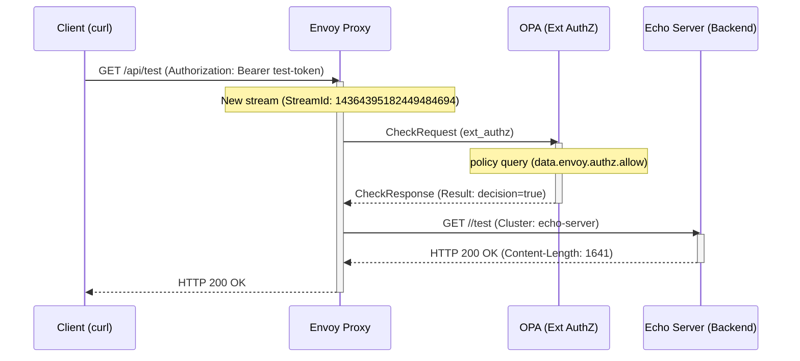

# Envoy External Authorization Filter Simple PoC

- [Envoy External Authorization Filter Simple PoC](#envoy-external-authorization-filter-simple-poc)
  - [Overview](#overview)
  - [Architecture](#architecture)
  - [Sequence](#sequence)
  - [Steps](#steps)
    - [Create Kind Cluster](#create-kind-cluster)
    - [Deploy \& Run](#deploy--run)
    - [Clean up kind cluster](#clean-up-kind-cluster)
  - [Functionality Testing](#functionality-testing)
    - [Basic Test Cases](#basic-test-cases)
    - [Detailed Testing](#detailed-testing)
  - [Configuration Details](#configuration-details)
    - [Envoy Configuration (`envoy/envoy.yaml`)](#envoy-configuration-envoyenvoyyaml)
    - [OPA Configuration (`opa/config.yaml`, `authz.rego`)](#opa-configuration-opaconfigyaml-authzrego)
    - [Scalability](#scalability)
  - [Ref](#ref)

This repository provides a simple proof-of-concept (PoC) setup for implementing authentication and authorization using **OPA (Open Policy Agent)** with the **Envoy External Authorization Filter** .

## Overview

This PoC consists of the following main components:

- **Envoy Proxy**: Functions as a reverse proxy (Sidecar/Gateway pattern) and applies the **External Authorization Filter** to incoming HTTP requests.
- **OPA (Open Policy Agent)**: Receives authorization requests (`CheckRequest`) from Envoy via **gRPC** and performs **authorization decisions** based on Rego policies.
- **Echo Server**: A test **backend service** that is only accessed when authorization succeeds.

## Architecture

External requests are intercepted by Envoy's **HTTP Connection Manager**. The **ExtAuthz** filter blocks forwarding to the backend service until OPA returns an `OK` status.

## Sequence



## Steps

### Create Kind Cluster

```bash
kind create cluster
```

### Deploy & Run

1. **Deploy**

    ```bash
    make deploy
    ```

2. **Access via Port Forwarding**

    ```bash
    kubectl port-forward -n envoy-authz-poc service/envoy 8080:8080
    ```

3. **Test**

    ```bash
    make test
    ```

4. **Resource Deletion**

    ```bash
    make k8s-clean
    ```

### Clean up kind cluster

```bash
kind delete clusters --all
```

## Functionality Testing

### Basic Test Cases

Verify that Envoy allows/denies requests based on the policy rules (Public paths, Token validation, Method checks).

| No. | Command | Authentication State | Expected Result |
| :--- | :--- | :--- | :--- |
| 1 | `curl -i http://localhost:8080/health` | No Authentication (Public Path) | `HTTP 200 OK` |
| 2 | `curl -i http://localhost:8080/api/test` | No Authentication (Protected Resource) | `HTTP 403 Forbidden` |
| 3 | `curl -i -H "Authorization: Bearer test-token" http://localhost:8080/api/test` | Valid token (`test-token`) | `HTTP 200 OK` |
| 4 | `curl -i -H "Authorization: Bearer admin-token" http://localhost:8080/api/test` | Administrator token | `HTTP 200 OK` |
| 5 | `curl -i -H "Authorization: Bearer invalid-token" http://localhost:8080/api/test` | Invalid token | `HTTP 403 Forbidden` |

### Detailed Testing

- **Verifying Response Headers (On Success)**

    ```bash
    curl -v -H "Authorization: Bearer test-token" http://localhost:8080/api/test
    ```

- **Verify OPA Policy (Debug)**

    Access OPA's HTTP API (`/v1/data`) via Envoy (configured as a public path) to inspect the current policy state or evaluation results.

    ```bash
    curl -s http://localhost:8080/v1/data/envoy/authz/debug_info
    ```

## Configuration Details

### Envoy Configuration (`envoy/envoy.yaml`)

- **Listener Ports**: `8080` (Traffic), `9901` (Admin Interface).
- **ExtAuthz Integration**: Configured to communicate with the `opa-envoy` cluster on Port `9191` (gRPC).
- **Routing Strategy**:
  - **Per-Route Config**: `/health` and `/v1/data` are explicitly configured to **disable** the ExtAuthz filter (bypass OPA).
  - **Default**: All other routes enforce the ExtAuthz filter.

### OPA Configuration (`opa/config.yaml`, `authz.rego`)

- **Interfaces**: gRPC (`9191`) for Envoy checks, HTTP (`8181`) for management/data.
- **Policy Logic (`authz.rego`)**:
  - **Declarative Model**: The policy defines multiple `allow` rules.
  - **Structure**:
    - Rule 1: Allow if `Bearer admin-token` is present.
    - Rule 2: Allow if `Bearer test-token` is present.
    - Rule 3: Allow if path is in `public_paths`.
    - Rule 4: Allow if method is `GET` AND user is authenticated.
      - **Evaluation**: These rules function as a logical **OR**. If any single rule matches, the request is allowed.

### Scalability

This PoC can be extended in the following directions:

1. **Advanced Authentication Integration**
   - Implementation of real JWT verification (replacing the hardcoded string check).
   - Integration with OIDC Providers (Keycloak, Auth0, etc.).
2. **Granular Access Control**
   - Implementing RBAC (Role-Based Access Control) based on token claims.
3. **Operations and Monitoring**
   - Export OPA decision logs to an external system.
   - Prometheus metrics for authorization latency and decision counts.

## Ref

- [Envoy External Authorization Filter](https://www.envoyproxy.io/docs/envoy/latest/intro/arch_overview/security/ext_authz_filter)
- [Open Policy Agent - Envoy Tutorial](https://www.openpolicyagent.org/docs/latest/envoy-tutorial-standalone-envoy/)
