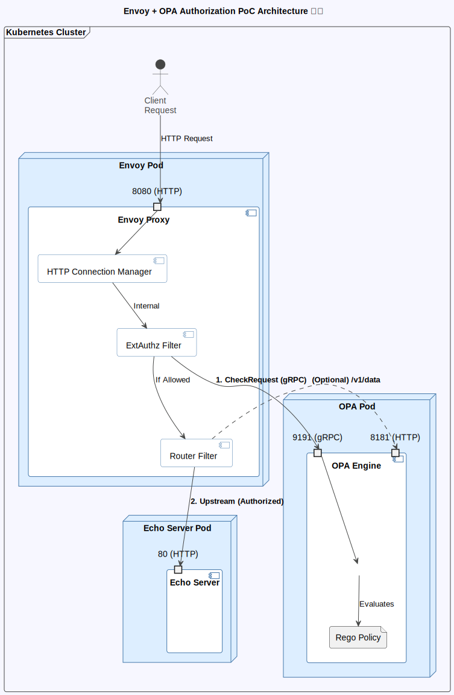
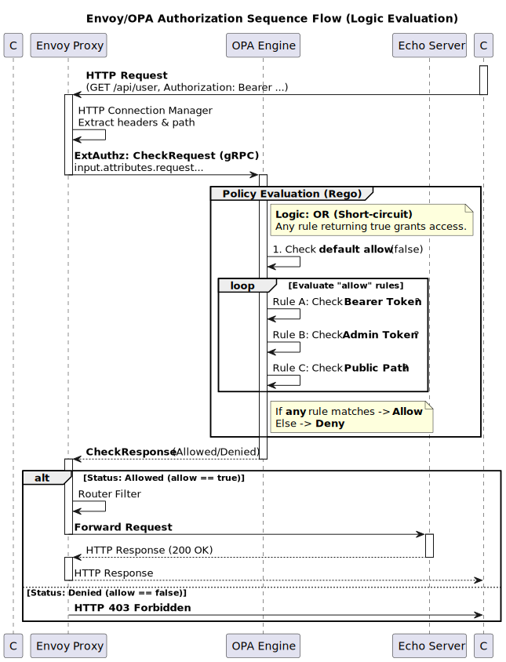

# Envoy External Authorization Filter Simple PoC

- [Envoy External Authorization Filter Simple PoC](#envoy-external-authorization-filter-simple-poc)
  - [Overview](#overview)
  - [Architecture](#architecture)
  - [Sequence](#sequence)
  - [Steps](#steps)
    - [Deploy \& Run](#deploy--run)
  - [Functionality Testing](#functionality-testing)
    - [Basic Test Cases](#basic-test-cases)
    - [Detailed Testing](#detailed-testing)
  - [Configuration Details](#configuration-details)
    - [Envoy Configuration (`envoy/envoy.yaml`)](#envoy-configuration-envoyenvoyyaml)
    - [OPA Configuration (`opa/config.yaml`, `authz.rego`)](#opa-configuration-opaconfigyaml-authzrego)
    - [Scalability](#scalability)
  - [Troubleshooting](#troubleshooting)
    - [Common Issues and Debugging Methods](#common-issues-and-debugging-methods)
    - [How to Check Logs](#how-to-check-logs)
  - [Reference Materials](#reference-materials)

This repository provides a simple proof-of-concept (PoC) setup for implementing authentication and authorization using **OPA (Open Policy Agent)** with the **Envoy External Authorization Filter**.

## Overview

This PoC consists of the following main components.

* **Envoy Proxy**: Functions as a reverse proxy and applies the **External Authorization Filter** to HTTP requests.
* **OPA (Open Policy Agent)**: Receives authorization requests from Envoy and performs **authorization decisions** based on policies. It communicates with Envoy via gRPC.
* **Echo Server**: A test **backend service** that is only accessed when authorization succeeds.

## Architecture

External requests are captured by Envoy and blocked from being forwarded to the backend service until authorization is completed.



## Sequence



1. Client sends a request to Envoy
2. Envoy requests an authorization decision from OPA via the External Authorization Filter
3. OPA performs the authorization decision based on the Rego policy
4. If authorized, Envoy forwards the request to the backend service (Echo Server)

## Steps

### Deploy & Run

1. **Deploy**

    ```bash
    make k8s-deploy
    ```

2. **Access via Port Forwarding**

    ```bash
    kubectl port-forward -n envoy-authz-poc service/envoy 8080:8080
    ```

3. **Test**

    ```bash
    make test
    ```

4. **Resource Deletion**

    ```bash
    make k8s-clean
    ```

## Functionality Testing

### Basic Test Cases

Verify that Envoy allows/denies requests based on policies.

| No. | Command | Authentication State | Expected Result |
| :--- | :--- | :--- | :--- |
| 1 | `curl -i http://localhost:8080/health` | No Authentication (Envoy Bypass) | `HTTP 200 OK` |
| 2 | `curl -i http://localhost:8080/api/test` | No Authentication (Protected Resource) | `HTTP 403 Forbidden` |
| 3 | `curl -i -H “Authorization: Bearer test-token” http://localhost:8080/api/test` | Valid token | `HTTP 200 OK` |
| 4 | `curl -i -H “Authorization: Bearer admin-token” http://localhost:8080/api/test` | Administrator token | `HTTP 200 OK` |
| 5 | `curl -i -H “Authorization: Bearer invalid-token” http://localhost:8080/api/test` | Invalid token | `HTTP 403 Forbidden` |

### Detailed Testing

* **Verifying Response Headers (On Success)**

    ```bash
    curl -v -H “Authorization: Bearer test-token” http://localhost:8080/api/test
    ```

* **Verify OPA Policy (Debug)**

    Access OPA's HTTP API (`/v1/data`) via Envoy to inspect policy data.

    ```bash
    curl -s http://localhost:8080/v1/data/envoy/authz/debug_info
    ```

## Configuration Details

### Envoy Configuration (`envoy/envoy.yaml`)

* **Listener Ports**: `8080` (HTTP), `9901` (Management UI)
* **ExtAuthz Integration**: Connects to OPA's gRPC endpoint (`opa-envoy` cluster, Port `9191`).
* **Routing**:
  * Paths `/health` and `/v1/data` have the ExtAuthz filter **disabled** (no authentication required).
  * All other paths have the ExtAuthz filter applied and are routed to `echo-server`.

### OPA Configuration (`opa/config.yaml`, `authz.rego`)

* **Service Ports**: gRPC server (`9191`), HTTP API (`8181`)
* **Authorization Policy (`authz.rego`)**:
  * Allow access for `Bearer test-token` or `Bearer admin-token`.
  * Allow access if the HTTP method is **`GET`** and the user is authenticated.
  * `/health` and `/v1/data` are also permitted by the policy.

### Scalability

This PoC can be extended in the following directions:

1. **Advanced Authentication Integration**
      * Implementation of JWT verification logic.
      * Integration with external Identity Providers (IDPs).
2. **Granular Access Control**
      * Resource-based access control (RBAC/ABAC).
3. **Operations and Monitoring**
      * Export Prometheus metrics.
      * Enhance authentication and authorization logging.

## Troubleshooting

### Common Issues and Debugging Methods

1. **Port Conflict**

    ```bash
    # Check ports in use
    lsof -i :8080
    lsof -i :9191
    ```

2. **Debugging OPA Policies**

    ```bash
    # Check OPA logs
    kubectl logs -n envoy-authz-poc deployment/opa -f
    ```

3. **Verify Envoy Configuration**

    ```bash
    # Access Envoy management UI
    curl http://localhost:9901/config_dump
    ```

### How to Check Logs

```bash
# Monitor logs for all Pods
kubectl logs -n envoy-authz-poc -l app=envoy -f
kubectl logs -n envoy-authz-poc -l app=opa -f
kubectl logs -n envoy-authz-poc -l app=echo-server -f
```

## Reference Materials

* [Envoy External Authorization Filter](https://www.envoyproxy.io/docs/envoy/latest/intro/arch_overview/security/ext_authz_filter)
* [Open Policy Agent - Envoy Tutorial](https://www.openpolicyagent.org/docs/latest/envoy-tutorial-standalone-envoy/)
