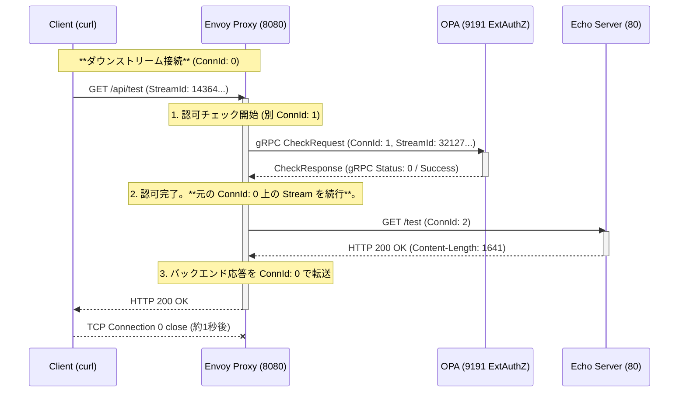

# Envoy: OPA example

- [Envoy: OPA example](#envoy-opa-example)
  - [Overview](#overview)
  - [Logs \& Action](#logs--action)
    - [1. クライアントからのリクエスト受信 (Ingress)](#1-クライアントからのリクエスト受信-ingress)
    - [2. 外部認可 (Ext AuthZ) の実行](#2-外部認可-ext-authz-の実行)
    - [3. バックエンドサービスへのプロキシ](#3-バックエンドサービスへのプロキシ)
    - [4. クライアントへの最終レスポンス (Egress)](#4-クライアントへの最終レスポンス-egress)
  - [Appendix](#appendix)
    - [Connection IDとは？](#connection-idとは)
    - [「元の Connection ID」について](#元の-connection-idについて)
    - [Stream ID (ストリームID) と Connection ID の関係](#stream-id-ストリームid-と-connection-id-の関係)
      - [具体的な関係性の図](#具体的な関係性の図)
  - [Logs](#logs)
    - [Envoy](#envoy)
    - [Open Policy Agent](#open-policy-agent)

**Envoy Proxy** が **Open Policy Agent (OPA)** を利用して外部認可を実行し、バックエンドサービスにリクエストをプロキシする一連の処理を、詳細なログと設定に基づいて解析します。

## Overview

```bash
$ curl -i -H "Authorization: Bearer test-token" http://localhost:8080/api/test
```


リクエストの流れは以下の4つのフェーズに分かれ、Envoyが複数の独立した **TCP接続 (ConnId)** と **HTTPストリーム (StreamId)** を管理していることが確認できます。



## Logs & Action

### 1. クライアントからのリクエスト受信 (Ingress)

クライアント（`curl/8.7.1`）からのリクエストを Envory のリスナー (8080) が受信し、TCP接続（ダウンストリーム）とHTTPストリームを確立します。

| 時刻 | エンティティ | 接続/ストリームID | ログ/アクション | 詳細 |
| :--- | :--- | :--- | :--- | :--- |
| **16:02:27.481** | Envoy | **ConnId: 0** | `new connection from 127.0.0.1:48524` | クライアントとの新しいTCP接続確立。 |
| **16:02:27.482** | Envoy | **StreamId: 14364...** | `new stream` | HTTPコネクションマネージャがストリーム開始。 |
| **16:02:27.483** | Envoy | - | `request headers complete` | `GET /api/test` と `Authorization: Bearer test-token` ヘッダーを解析。 |

### 2. 外部認可 (Ext AuthZ) の実行

HTTPフィルタチェーンの **`envoy.filters.http.ext_authz`** が動作し、リクエストを **OPA (opa-envoy)** に gRPC で送信して認可を求めます。

| 時刻 | エンティティ | 接続/ストリームID | ログ/アクション | 詳細 |
| :--- | :--- | :--- | :--- | :--- |
| **16:02:27.484** | Envoy | **StreamId: 32127...** | `cluster 'opa-envoy' match for URL '...Check'` | Ext AuthZが gRPC CheckRequest のルーティングを決定。 |
| **16:02:27.485** | Envoy | **ConnId: 1** | `creating a new connection` | OPA (127.0.0.1:9191) への新しいTCP接続 (アップストリーム) を確立。 |
| **16:02:27.487** | Envoy | ConnId: 1 | `encode complete` | OPAへ gRPC `CheckRequest` を送信。 |
| **16:02:27.495** | OPA | **Decision ID:** `55665fb1-...` | `query:"data.envoy.authz.allow" "result":true` | OPAがポリシーを評価し、`Bearer test-token` に基づき **認可成功** を決定。 |
| **16:02:27.497** | Envoy | **ConnId: 1** | `response complete ... 'grpc-status', '0'` | OPAからの `CheckResponse` を受信。gRPCステータス `0` は成功。 |

### 3. バックエンドサービスへのプロキシ

認可が成功したため、Envoyはリクエストを `echo-server` クラスターに転送します。ルーティング設定に基づき、パスの書き換えが行われます。

| 時刻 | エンティティ | 接続/ストリームID | ログ/アクション | 詳細 |
| :--- | :--- | :--- | :--- | :--- |
| **16:02:27.497** | Envoy | **StreamId: 14364...** | `cluster 'echo-server' match for URL '/api/test'` | ルーティングが `echo-server` クラスターに決定。 |
| **16:02:27.497** | Envoy | **ConnId: 2** | `creating a new connection... to 127.0.0.1:80` | Echo Serverへの新しいTCP接続 (アップストリーム) を確立。 |
| **16:02:27.497** | Envoy | StreamId: 14364... | `router decoding headers: ... ':path', '//test'` | 設定 (`prefix_rewrite: "/"`) に従い、パスを `/api/test` から `/test` に書き換えて送信。 |
| **16:02:27.521** | Envoy | StreamId: 14364... | `upstream headers complete: ':status', '200'` | Echo Serverからレスポンスを受信。**アップストリームサービス時間: 23ms**。 |

### 4. クライアントへの最終レスポンス (Egress)

Envoyはバックエンドからのレスポンスをクライアントに転送し、処理を終了します。

| 時刻 | エンティティ | 接続/ストリームID | ログ/アクション | 詳細 |
| :--- | :--- | :--- | :--- | :--- |
| **16:02:27.521** | Envoy | StreamId: 14364... | `encoding headers via codec: ':status', '200'` | クライアントへ `HTTP 200 OK` を転送開始。 |
| **16:02:27.522** | Envoy | - | アクセスログ: `200 - 0 1641 39 23` | **合計処理時間 39ms**。レスポンスサイズ 1641バイト。 |
| **16:02:28.530** | Envoy | **ConnId: 0** | `remote close` | クライアントとのTCP接続を終了。 |

## Appendix

### Connection IDとは？

**Connection ID (ConnId)** は、**Envoy** が管理している **TCP (Transmission Control Protocol) 接続**、すなわちネットワークソケットを一意に識別するためのIDです。

これは、クライアントとEnvoyの間、またはEnvoyとバックエンドサービスの間で確立された**永続的な通信チャネル**の識別子です。

* **物理層に近いレベル:** ConnId は、OSレベルで確立されるソケット接続に対応します。
* **用途:** データが流れるパイプラインそのものを指します。
  * `ConnId: 0` はクライアント（ダウンストリーム）とのTCP接続。
  * `ConnId: 1` は OPA（アップストリーム）とのTCP接続。
  * `ConnId: 2` は Echo Server（アップストリーム）とのTCP接続。

### 「元の Connection ID」について

元の Connection IDとは、ログにおける **`ConnId: 0`** のことです。

| ID | 役割 | プロトコル |
| :---: | :--- | :--- |
| **`ConnId: 0`** | **元の（ダウンストリーム）接続** | TCP/HTTP (Client <-> Envoy) |
| **`ConnId: 1`** | 新しい（アップストリーム）接続 | TCP/gRPC (Envoy <-> OPA) |
| **`ConnId: 2`** | 新しい（アップストリーム）接続 | TCP/HTTP (Envoy <-> Echo Server) |

Envoyは、クライアントからのリクエストを受信する **`ConnId: 0`** を、認可チェックやバックエンド通信の最中も維持し、最終的なレスポンスをクライアントに返すために**再利用**します。

### Stream ID (ストリームID) と Connection ID の関係

**Stream ID** は、**HTTP/1.1 (キープアライブ)** や **HTTP/2** といったアプリケーション層のプロトコルで使用される概念で、**単一のTCP接続 (Connection ID)** の上で流れる **論理的なリクエストとレスポンスのペア** を識別します。

| 特徴 | Connection ID | Stream ID |
| :--- | :--- | :--- |
| **対応プロトコル** | TCP | HTTP/1.1 (再利用時) または HTTP/2 |
| **役割** | 物理的な**通信経路**（パイプライン）の識別。 | 経路（ConnId）上を流れる**個々のデータトランザクション**の識別。 |
| **ライフサイクル** | クライアントが切断するまで**永続的**。 | リクエストとレスポンスが完了すると**終了**。 |
| **ログの例** | `ConnId: 0` | `StreamId: 14364395182449484694` |

#### 具体的な関係性の図

1. **クライアントリクエスト**
   * **`ConnId: 0`** 上で **`StreamId: 14364...`** が開始されました。
   * このストリームは、Envoyがクライアントからの `GET /api/test` を処理している間、**一貫して保持**されます。

2. **OPAへの認可チェック**
   * Envoyは、認可チェックのために **新しいTCP接続 (`ConnId: 1`)** を確立しました。
   * この新しい接続の上で、認可チェック用の **新しい論理ストリーム (`StreamId: 32127...`)** が開始され、gRPC通信に使用されました。
   * つまり、**一つのクライアントリクエスト** (Stream 14364...) の処理中に、**別のアップストリームリクエスト** (Stream 32127...) が発生したということです。
3.  **Echo Serverへのプロキシ**
    * 同様に、Envoyは **新しいTCP接続 (`ConnId: 2`)** を確立し、その上でバックエンドへのプロキシリクエスト（論理ストリーム）を送信しました。

まとめると、**一つの Connection ID** は、**複数の Stream ID** を同時にまたは連続して処理するための基盤（パイプ）として機能します。しかし、Envoyが別のサービス（OPAやEcho Server）と通信する際は、それぞれ新しい Connection ID を確立するのが一般的な動作です。

## Logs

### Envoy

```bash
$ k logs -f envoy-ext-authz-opa-55c4d4794f-r2jmx -c envoy
...
[2025-11-28 16:02:27.481][20][debug][conn_handler] [source/extensions/listener_managers/listener_manager/active_tcp_listener.cc:159] [Tags: "ConnectionId":"0"] new connection from 127.0.0.1:48524
[2025-11-28 16:02:27.482][20][debug][http] [source/common/http/conn_manager_impl.cc:391] [Tags: "ConnectionId":"0"] new stream
[2025-11-28 16:02:27.483][20][debug][http] [source/common/http/conn_manager_impl.cc:1194] [Tags: "ConnectionId":"0","StreamId":"14364395182449484694"] request headers complete (end_stream=true):
':authority', 'localhost:8080'
':path', '/api/test'
':method', 'GET'
'user-agent', 'curl/8.7.1'
'accept', '*/*'
'authorization', 'Bearer test-token'

[2025-11-28 16:02:27.483][20][debug][http] [source/common/http/conn_manager_impl.cc:1177] [Tags: "ConnectionId":"0","StreamId":"14364395182449484694"] request end stream
[2025-11-28 16:02:27.483][20][debug][connection] [./source/common/network/connection_impl.h:98] [Tags: "ConnectionId":"0"] current connecting state: false
[2025-11-28 16:02:27.484][20][debug][router] [source/common/router/router.cc:520] [Tags: "ConnectionId":"0","StreamId":"321275418739896990"] cluster 'opa-envoy' match for URL '/envoy.service.auth.v3.Authorization/Check'
[2025-11-28 16:02:27.485][20][debug][router] [source/common/router/router.cc:732] [Tags: "ConnectionId":"0","StreamId":"321275418739896990"] router decoding headers:
':method', 'POST'
':path', '/envoy.service.auth.v3.Authorization/Check'
':authority', 'opa-envoy'
':scheme', 'http'
'te', 'trailers'
'grpc-timeout', '1000m'
'content-type', 'application/grpc'
'x-envoy-internal', 'true'
'x-forwarded-for', '10.244.0.5'
'x-envoy-expected-rq-timeout-ms', '1000'

[2025-11-28 16:02:27.485][20][debug][pool] [source/common/http/conn_pool_base.cc:78] queueing stream due to no available connections (ready=0 busy=0 connecting=0)
[2025-11-28 16:02:27.485][20][debug][pool] [source/common/conn_pool/conn_pool_base.cc:291] trying to create new connection
[2025-11-28 16:02:27.485][20][debug][pool] [source/common/conn_pool/conn_pool_base.cc:145] creating a new connection (connecting=0)
[2025-11-28 16:02:27.485][20][debug][http2] [source/common/http/http2/codec_impl.cc:1617] [Tags: "ConnectionId":"1"] updating connection-level initial window size to 268435456
[2025-11-28 16:02:27.485][20][debug][connection] [./source/common/network/connection_impl.h:98] [Tags: "ConnectionId":"1"] current connecting state: true
[2025-11-28 16:02:27.485][20][debug][client] [source/common/http/codec_client.cc:57] [Tags: "ConnectionId":"1"] connecting
[2025-11-28 16:02:27.485][20][debug][connection] [source/common/network/connection_impl.cc:1009] [Tags: "ConnectionId":"1"] connecting to 127.0.0.1:9191
[2025-11-28 16:02:27.486][20][debug][connection] [source/common/network/connection_impl.cc:1028] [Tags: "ConnectionId":"1"] connection in progress
[2025-11-28 16:02:27.486][20][debug][connection] [source/common/network/connection_impl.cc:746] [Tags: "ConnectionId":"1"] connected
[2025-11-28 16:02:27.486][20][debug][client] [source/common/http/codec_client.cc:88] [Tags: "ConnectionId":"1"] connected
[2025-11-28 16:02:27.486][20][debug][pool] [source/common/conn_pool/conn_pool_base.cc:328] [Tags: "ConnectionId":"1"] attaching to next stream
[2025-11-28 16:02:27.486][20][debug][pool] [source/common/conn_pool/conn_pool_base.cc:182] [Tags: "ConnectionId":"1"] creating stream
[2025-11-28 16:02:27.486][20][debug][router] [source/common/router/upstream_request.cc:579] [Tags: "ConnectionId":"0","StreamId":"321275418739896990"] pool ready
[2025-11-28 16:02:27.487][20][debug][client] [source/common/http/codec_client.cc:141] [Tags: "ConnectionId":"1"] encode complete
[2025-11-28 16:02:27.496][20][debug][router] [source/common/router/router.cc:1493] [Tags: "ConnectionId":"0","StreamId":"321275418739896990"] upstream headers complete: end_stream=false
[2025-11-28 16:02:27.497][20][debug][http] [source/common/http/async_client_impl.cc:141] async http request response headers (end_stream=false):
':status', '200'
'content-type', 'application/grpc'
'x-envoy-upstream-service-time', '10'

[2025-11-28 16:02:27.497][20][debug][client] [source/common/http/codec_client.cc:128] [Tags: "ConnectionId":"1"] response complete
[2025-11-28 16:02:27.497][20][debug][pool] [source/common/conn_pool/conn_pool_base.cc:215] [Tags: "ConnectionId":"1"] destroying stream: 0 remaining
[2025-11-28 16:02:27.497][20][debug][http] [source/common/http/async_client_impl.cc:168] async http request response trailers:
'grpc-status', '0'
'grpc-message', ''

[2025-11-28 16:02:27.497][20][debug][router] [source/common/router/router.cc:520] [Tags: "ConnectionId":"0","StreamId":"14364395182449484694"] cluster 'echo-server' match for URL '/api/test'
[2025-11-28 16:02:27.497][20][debug][router] [source/common/router/router.cc:732] [Tags: "ConnectionId":"0","StreamId":"14364395182449484694"] router decoding headers:
':authority', 'localhost:8080'
':path', '//test'
':method', 'GET'
':scheme', 'http'
'user-agent', 'curl/8.7.1'
'accept', '*/*'
'authorization', 'Bearer test-token'
'x-forwarded-proto', 'http'
'x-request-id', '1b07886b-9d46-4a9a-b3ba-3d24b1baec94'
'x-envoy-expected-rq-timeout-ms', '15000'
'x-envoy-original-path', '/api/test'

[2025-11-28 16:02:27.497][20][debug][pool] [source/common/http/conn_pool_base.cc:78] queueing stream due to no available connections (ready=0 busy=0 connecting=0)
[2025-11-28 16:02:27.497][20][debug][pool] [source/common/conn_pool/conn_pool_base.cc:291] trying to create new connection
[2025-11-28 16:02:27.497][20][debug][pool] [source/common/conn_pool/conn_pool_base.cc:145] creating a new connection (connecting=0)
[2025-11-28 16:02:27.497][20][debug][connection] [./source/common/network/connection_impl.h:98] [Tags: "ConnectionId":"2"] current connecting state: true
[2025-11-28 16:02:27.497][20][debug][client] [source/common/http/codec_client.cc:57] [Tags: "ConnectionId":"2"] connecting
[2025-11-28 16:02:27.497][20][debug][connection] [source/common/network/connection_impl.cc:1009] [Tags: "ConnectionId":"2"] connecting to 127.0.0.1:80
[2025-11-28 16:02:27.497][20][debug][connection] [source/common/network/connection_impl.cc:1028] [Tags: "ConnectionId":"2"] connection in progress
[2025-11-28 16:02:27.498][20][debug][http2] [source/common/http/http2/codec_impl.cc:1362] [Tags: "ConnectionId":"1"] stream 1 closed: 0
[2025-11-28 16:02:27.498][20][debug][http2] [source/common/http/http2/codec_impl.cc:1426] [Tags: "ConnectionId":"1"] Recouping 0 bytes of flow control window for stream 1.
[2025-11-28 16:02:27.498][20][debug][connection] [source/common/network/connection_impl.cc:746] [Tags: "ConnectionId":"2"] connected
[2025-11-28 16:02:27.498][20][debug][client] [source/common/http/codec_client.cc:88] [Tags: "ConnectionId":"2"] connected
[2025-11-28 16:02:27.498][20][debug][pool] [source/common/conn_pool/conn_pool_base.cc:328] [Tags: "ConnectionId":"2"] attaching to next stream
[2025-11-28 16:02:27.498][20][debug][pool] [source/common/conn_pool/conn_pool_base.cc:182] [Tags: "ConnectionId":"2"] creating stream
[2025-11-28 16:02:27.498][20][debug][router] [source/common/router/upstream_request.cc:579] [Tags: "ConnectionId":"0","StreamId":"14364395182449484694"] pool ready
[2025-11-28 16:02:27.498][20][debug][client] [source/common/http/codec_client.cc:141] [Tags: "ConnectionId":"2"] encode complete
[2025-11-28 16:02:27.521][20][debug][router] [source/common/router/router.cc:1493] [Tags: "ConnectionId":"0","StreamId":"14364395182449484694"] upstream headers complete: end_stream=false
[2025-11-28 16:02:27.521][20][debug][http] [source/common/http/conn_manager_impl.cc:1863] [Tags: "ConnectionId":"0","StreamId":"14364395182449484694"] encoding headers via codec (end_stream=false):
':status', '200'
'content-type', 'application/json; charset=utf-8'
'content-length', '1641'
'etag', 'W/"669-3UkbKSnCB2XwUVjIiQPavJ906E8"'
'date', 'Fri, 28 Nov 2025 16:02:27 GMT'
'x-envoy-upstream-service-time', '23'
'server', 'envoy'

[2025-11-28 16:02:27.522][20][debug][client] [source/common/http/codec_client.cc:128] [Tags: "ConnectionId":"2"] response complete
[2025-11-28 16:02:27.522][20][debug][http] [source/common/http/conn_manager_impl.cc:1968] [Tags: "ConnectionId":"0","StreamId":"14364395182449484694"] Codec completed encoding stream.
[2025-11-28 16:02:27.522][20][debug][pool] [source/common/http/http1/conn_pool.cc:53] [Tags: "ConnectionId":"2"] response complete
[2025-11-28T16:02:27.482Z] "GET /api/test HTTP/1.1" 200 - 0 1641 39 23 "-" "curl/8.7.1" "1b07886b-9d46-4a9a-b3ba-3d24b1baec94" "localhost:8080" "127.0.0.1:80"
[2025-11-28 16:02:27.522][20][debug][pool] [source/common/conn_pool/conn_pool_base.cc:215] [Tags: "ConnectionId":"2"] destroying stream: 0 remaining
[2025-11-28 16:02:28.530][20][debug][connection] [source/common/network/connection_impl.cc:714] [Tags: "ConnectionId":"0"] remote close
[2025-11-28 16:02:28.530][20][debug][connection] [source/common/network/connection_impl.cc:278] [Tags: "ConnectionId":"0"] closing socket: 0
```

### Open Policy Agent

```bash
$ k logs -f envoy-ext-authz-opa-55c4d4794f-r2jmx -c opa
...
{"headers":{"Accept-Ranges":["bytes"],"Access-Control-Allow-Origin":["*"],"Access-Control-Expose-Headers":["ETag, Link, Location, Retry-After, X-GitHub-OTP, X-RateLimit-Limit, X-RateLimit-Remaining, X-RateLimit-Used, X-RateLimit-Resource, X-RateLimit-Reset, X-OAuth-Scopes, X-Accepted-OAuth-Scopes, X-Poll-Interval, X-GitHub-Media-Type, X-GitHub-SSO, X-GitHub-Request-Id, Deprecation, Sunset"],"Cache-Control":["public, max-age=60, s-maxage=60"],"Content-Security-Policy":["default-src 'none'"],"Content-Type":["application/json; charset=utf-8"],"Date":["Fri, 28 Nov 2025 16:01:21 GMT"],"Etag":["W/\"e71c6915e515a8c4f88a6cca997b000e44529ac1a2552af98bef5806f1ae7699\""],"Last-Modified":["Wed, 26 Nov 2025 13:24:08 GMT"],"Referrer-Policy":["origin-when-cross-origin, strict-origin-when-cross-origin"],"Server":["github.com"],"Strict-Transport-Security":["max-age=31536000; includeSubdomains; preload"],"Vary":["Accept,Accept-Encoding, Accept, X-Requested-With"],"X-Content-Type-Options":["nosniff"],"X-Frame-Options":["deny"],"X-Github-Api-Version-Selected":["2022-11-28"],"X-Github-Media-Type":["github.v3; format=json"],"X-Github-Request-Id":["ED90:7362A:81C099:A05EBB:6929C764"],"X-Ratelimit-Limit":["60"],"X-Ratelimit-Remaining":["58"],"X-Ratelimit-Reset":["1764348701"],"X-Ratelimit-Resource":["core"],"X-Ratelimit-Used":["2"],"X-Xss-Protection":["0"]},"level":"debug","method":"GET","msg":"Received response.","status":"200 OK","time":"2025-11-28T16:01:40Z","url":"https://api.github.com/repos/open-policy-agent/opa/releases/latest"}
{"current_version":"1.11.0","level":"debug","msg":"OPA is up to date.","time":"2025-11-28T16:01:40Z"}
{"decision-id":"55665fb1-9f83-4899-94c0-6c276d274388","level":"debug","msg":"no content-type header supplied, performing no body parsing","time":"2025-11-28T16:02:27Z"}
{"input":[[{"type":"string","value":"attributes"},{"type":"object","value":[[{"type":"string","value":"destination"},{"type":"object","value":[[{"type":"string","value":"address"},{"type":"object","value":[[{"type":"string","value":"socketAddress"},{"type":"object","value":[[{"type":"string","value":"address"},{"type":"string","value":"127.0.0.1"}],[{"type":"string","value":"portValue"},{"type":"number","value":8080}]]}]]}]]}],[{"type":"string","value":"metadataContext"},{"type":"object","value":[]}],[{"type":"string","value":"request"},{"type":"object","value":[[{"type":"string","value":"http"},{"type":"object","value":[[{"type":"string","value":"headers"},{"type":"object","value":[[{"type":"string","value":":authority"},{"type":"string","value":"localhost:8080"}],[{"type":"string","value":":method"},{"type":"string","value":"GET"}],[{"type":"string","value":":path"},{"type":"string","value":"/api/test"}],[{"type":"string","value":":scheme"},{"type":"string","value":"http"}],[{"type":"string","value":"accept"},{"type":"string","value":"*/*"}],[{"type":"string","value":"authorization"},{"type":"string","value":"Bearer test-token"}],[{"type":"string","value":"user-agent"},{"type":"string","value":"curl/8.7.1"}],[{"type":"string","value":"x-forwarded-proto"},{"type":"string","value":"http"}],[{"type":"string","value":"x-request-id"},{"type":"string","value":"1b07886b-9d46-4a9a-b3ba-3d24b1baec94"}]]}],[{"type":"string","value":"host"},{"type":"string","value":"localhost:8080"}],[{"type":"string","value":"id"},{"type":"string","value":"14364395182449484694"}],[{"type":"string","value":"method"},{"type":"string","value":"GET"}],[{"type":"string","value":"path"},{"type":"string","value":"/api/test"}],[{"type":"string","value":"protocol"},{"type":"string","value":"HTTP/1.1"}],[{"type":"string","value":"scheme"},{"type":"string","value":"http"}]]}],[{"type":"string","value":"time"},{"type":"object","value":[[{"type":"string","value":"nanos"},{"type":"number","value":482449000}],[{"type":"string","value":"seconds"},{"type":"number","value":1764345747}]]}]]}],[{"type":"string","value":"source"},{"type":"object","value":[[{"type":"string","value":"address"},{"type":"object","value":[[{"type":"string","value":"socketAddress"},{"type":"object","value":[[{"type":"string","value":"address"},{"type":"string","value":"127.0.0.1"}],[{"type":"string","value":"portValue"},{"type":"number","value":48524}]]}]]}]]}]]}],[{"type":"string","value":"parsed_body"},{"type":"null","value":{}}],[{"type":"string","value":"parsed_path"},{"type":"array","value":[{"type":"string","value":"api"},{"type":"string","value":"test"}]}],[{"type":"string","value":"parsed_query"},{"type":"object","value":[]}],[{"type":"string","value":"truncated_body"},{"type":"boolean","value":false}],[{"type":"string","value":"version"},{"type":"object","value":[[{"type":"string","value":"encoding"},{"type":"string","value":"protojson"}],[{"type":"string","value":"ext_authz"},{"type":"string","value":"v3"}]]}]],"level":"debug","msg":"Executing policy query.","query":"data.envoy.authz.allow","time":"2025-11-28T16:02:27Z","txn":3}
{"decision":true,"decision-id":"55665fb1-9f83-4899-94c0-6c276d274388","dry-run":false,"err":null,"level":"debug","metrics":{"timer_rego_query_compile_ns":244583,"timer_rego_query_eval_ns":222583,"timer_server_handler_ns":0},"msg":"Returning policy decision.","query":"data.envoy.authz.allow","time":"2025-11-28T16:02:27Z","total_decision_time":2473208,"txn":3}
{"decision_id":"55665fb1-9f83-4899-94c0-6c276d274388","input":{"attributes":{"destination":{"address":{"socketAddress":{"address":"127.0.0.1","portValue":8080}}},"metadataContext":{},"request":{"http":{"headers":{":authority":"localhost:8080",":method":"GET",":path":"/api/test",":scheme":"http","accept":"*/*","authorization":"Bearer test-token","user-agent":"curl/8.7.1","x-forwarded-proto":"http","x-request-id":"1b07886b-9d46-4a9a-b3ba-3d24b1baec94"},"host":"localhost:8080","id":"14364395182449484694","method":"GET","path":"/api/test","protocol":"HTTP/1.1","scheme":"http"},"time":{"nanos":482449000,"seconds":1764345747}},"source":{"address":{"socketAddress":{"address":"127.0.0.1","portValue":48524}}}},"parsed_body":null,"parsed_path":["api","test"],"parsed_query":{},"truncated_body":false,"version":[[{"type":"string","value":"encoding"},{"type":"string","value":"protojson"}],[{"type":"string","value":"ext_authz"},{"type":"string","value":"v3"}]]},"labels":{"id":"296d7e57-e015-4a5b-b15c-960397062b9c","version":"1.11.0"},"level":"info","metrics":{"timer_rego_query_compile_ns":244583,"timer_rego_query_eval_ns":222583,"timer_server_handler_ns":2478750},"msg":"Decision Log","path":"envoy/authz/allow","result":true,"time":"2025-11-28T16:02:27Z","timestamp":"2025-11-28T16:02:27.495578005Z","type":"openpolicyagent.org/decision_logs"}
```
